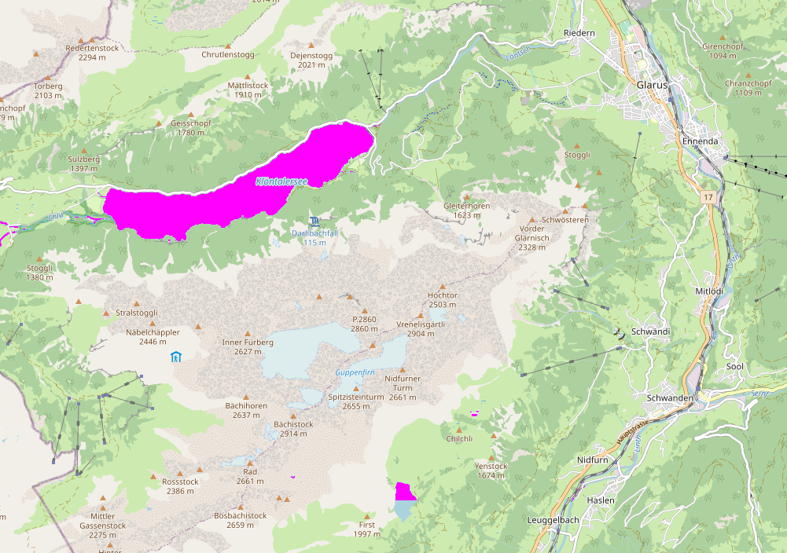

# maplibre-raster-preprocess
Preprocess raster tiles in a HTML Canvas in MapLibre GL JS with [`addProtocol`](https://maplibre.org/maplibre-gl-js/docs/API/classes/default/#addprotocol)

The [`addProtocol`](https://maplibre.org/maplibre-gl-js/docs/API/classes/default/#addprotocol) allows to preprocess tiles when MapLibre GL JS requests them. In this demo, raster tiles are loaded from OpenStreetMap and pixels with the color `rgb(170,211,223)`, i.e., the water bodies, are recolored from blue to pink.

This demo is quite inefficient because it creates a new HTML canvas for every tile that gets loaded. This should probably be the first thing to optimize if you want to use this in an actual map.

The advantage of using HTML canvas is that you can apply all the standard [CSS image filters](https://developer.mozilla.org/en-US/docs/Web/CSS/filter) to your raster tiles.

## Demo

OpenStreetMap Carto of Glarus, Switzerland with lakes colored pink.

https://wipfli.github.io/maplibre-raster-preprocess/

